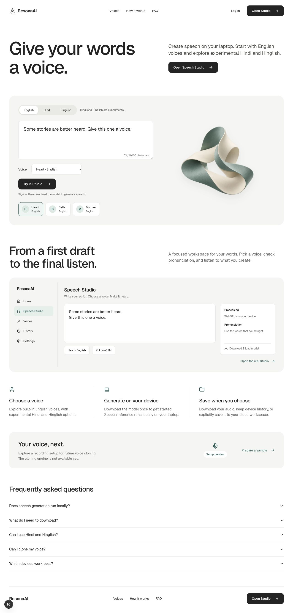
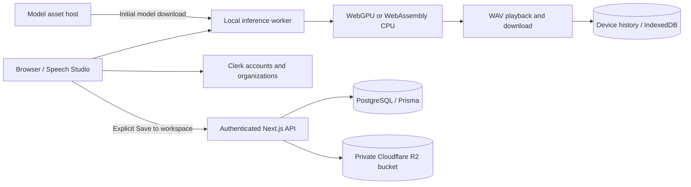

# ResonaAI

Text-to-speech on your laptop, with cloud accounts and optional workspace history.

ResonaAI runs Kokoro-82M inside the browser using **WebGPU**, with a manually selected **WebAssembly CPU** fallback. Speech inference does not call a cloud generation API. Clerk handles accounts and organizations; PostgreSQL and Cloudflare R2 support explicitly saved workspace results.

**Status:** an actively developed prototype. English built-in voices are available; Hindi and Hinglish are experimental. Voice cloning currently provides a frontend setup preview, not a working cloning engine.



## What works today

- Public landing page with language/voice selection and a script handoff into Studio.
- Speech Studio with local generation, voice selection, speaking speed, pronunciation overrides, cancellation, playback, a waveform derived from generated audio, and WAV download.
- Eight built-in voices: Heart, Bella, Michael, Emma, Alpha, Beta, Omega and Psi. Hindi voices also support experimental mixed-script Hinglish.
- Voice catalog with search, language filters, device-local favorites and locally generated previews.
- Workspace-scoped device history, script reuse and optional cloud save/history when storage is configured.
- Profile, Workspace and Device & Storage settings, including processing preference and removal of cached model downloads.
- Voice-cloning setup with recording validation and local playback. No recording upload or clone creation.
- Creator Projects with device-local chapters, named speakers, script blocks, reviewed TXT/DOCX/PDF import, sequential listening, bookmarks and chapter/full-project WAV export.
- Responsive layouts, keyboard-accessible controls and reduced-motion styles.

## Architecture and data


```mermaid
flowchart LR
    Browser[Browser / Speech Studio] --> Worker[Local inference worker]
    Host[Model asset host] -->|Initial model download| Worker
    Worker --> GPU[WebGPU or WebAssembly CPU]
    GPU --> Audio[WAV playback and download]
    Audio --> Device[(Device history / IndexedDB)]
    Browser --> Clerk[Clerk accounts and organizations]
    Browser -->|Explicit Save to workspace| API[Authenticated Next.js API]
    API --> DB[(PostgreSQL / Prisma)]
    API --> R2[(Private Cloudflare R2 bucket)]
```

Text and audio remain on the device during inference. **Save to workspace** uploads the selected text, audio and metadata. Accounts, organization management and cloud history require cloud services. Model downloads also require a network connection; browser caches can be evicted, so this is not a promise that the entire application works offline.

The pinned model is `onnx-community/Kokoro-82M-v1.0-ONNX`, revision `1939ad2a8e416c0acfeecc08a694d14ef25f2231`. WebGPU loads approximately **326 MB** of FP32 model weights; CPU uses approximately **93 MB** of Q8 weights, plus pronunciation and runtime files. Compatibility, loading time and generation speed depend on the browser and hardware. CPU fallback is selected manually in Studio.

Hindi and Hinglish output needs listening and pronunciation checks before publication. For Romanized Hindi, the pronunciation override can provide Devanagari text. Speech Studio accepts 5,000 characters per script; output is assembled before playback rather than streamed. Projects support up to 100,000 characters across scripts and pronunciation overrides, generating serial requests of at most 5,000 characters with Unicode-safe splitting.

## Creator Projects

Open **Projects** to create a project or import a TXT, DOCX or selectable-text PDF. Extraction runs locally, then a review step lets you edit the extracted text before saving. Files are limited to 20 MB and extracted text to 100,000 characters. Use `# Chapter title` lines to mark chapter boundaries; blank lines create script blocks. Scanned/image-only PDF pages require OCR in another tool, and password-protected PDFs require an unlocked copy.

Assign named speakers and built-in voices to blocks, adjust language, generation speed, pronunciation and pauses, then generate a block, chapter or project. Blocks and chapters can be reordered; place the cursor inside a block to split it after clearing any pronunciation override. Generation saves completed chunks locally and reuses only chunks matching the current script and speech settings. Changed or deleted blocks lose their obsolete audio on save.

Native audio playback advances through generated sections, with playback speed, chapter selection, bookmarks and a saved listening position. Download a chapter or the entire project as WAV after generating all sections. Editable projects and audio use IndexedDB scoped to the signed-in user and selected organization; they do not sync between devices, and browser storage removal loses them.

**Save chapter to workspace** uploads only the selected chapter's text, audio and metadata through the existing history API. It requires one voice, language, generation speed and compute backend throughout the chapter, with at most 5,000 characters, 20 minutes and 25 MB. Multi-speaker and larger chapters remain downloadable; the editable project stays local. See the [implementation and verification notes](docs/creator-studio-implementation-2026-10-05.md).

## Run locally

Use **Node.js 22.13 or later** (see `.nvmrc`) and npm. The authenticated workspace requires a Clerk application with Organizations enabled. PostgreSQL and a private R2 bucket are needed to exercise cloud persistence; R2 is optional for local generation.

```bash
git clone https://github.com/ayush-343/ResonaAI.git
cd ResonaAI
cp .env.example .env
```

Fill in `.env` before installing:

| Variable | Purpose |
| --- | --- |
| `NEXT_PUBLIC_CLERK_PUBLISHABLE_KEY` | Clerk browser authentication |
| `CLERK_SECRET_KEY` | Clerk server authentication |
| `DATABASE_URL` | PostgreSQL connection / Prisma configuration |
| `R2_ACCOUNT_ID` | Optional Cloudflare account for cloud audio |
| `R2_BUCKET_NAME` | Optional private audio bucket |
| `R2_ACCESS_KEY_ID` | Optional server-side R2 credential |
| `R2_SECRET_ACCESS_KEY` | Optional server-side R2 credential |

Never expose server credentials through `NEXT_PUBLIC_` variables or commit `.env` files.

```bash
npm ci
npx prisma migrate deploy
npm run dev
```

Installation generates the Prisma client and prepares the browser pronunciation/ONNX runtime assets. Generated files are ignored by Git. Migrations create the database schema; when using an existing database, review and baseline its migration history as appropriate before applying changes. This repository update does not migrate your database automatically.

Open [localhost:3000](http://localhost:3000), sign in, select or create a workspace, and open Studio. Choose GPU or CPU, click **Download & load model**, then generate speech. If GPU loading fails, select CPU and load again. Without R2 configuration, local generation and device history remain available; cloud actions show a configuration message.

## Pages

| Route | Purpose |
| --- | --- |
| `/` | Public landing page |
| `/home` | Protected dashboard and quick script entry |
| `/text-to-speech` | Speech Studio |
| `/projects` | Device-local creator project library and document import |
| `/projects/[id]` | Chapter and multi-speaker editor, listening and export |
| `/voices` | Built-in catalog and cloning setup preview |
| `/voices?tab=cloning` | Direct link to cloning setup |
| `/history` | Device and configured cloud history |
| `/settings/profile` | Account settings |
| `/settings/workspace` | Organization settings |
| `/settings/device` | Processing preference, cache and local storage |
| `/lab` | Public local inference benchmark; no cloud saving |

## Development

The stack uses Next.js 16 App Router, React 19, TypeScript, Tailwind CSS 4, shadcn/Radix UI, Clerk, Prisma 6, PostgreSQL, ONNX Runtime Web and Transformers.js. Speech runs in a worker. Browser pronunciation uses eSpeak NG.

```bash
npm run check     # TypeScript, tests, ESLint and design checks
npm run build     # Production build with Webpack
npm start         # Serve the production build
```

GitHub Actions runs `npm ci` and `npm run check`. Creator Projects validation passes `npm run check` with 27 tests; production compilation passed, with final build traces still completing at the time of the implementation report. An existing hook-dependency warning remains in the unused `wavy-background` component.

```text
src/app/                         Routes, layouts and authenticated APIs
src/features/landing/            Public landing page
src/features/dashboard/          Workspace shell and Home
src/features/text-to-speech/      Studio, waveform and draft persistence
src/features/tts-engine/          Model catalog, worker and audio utilities
src/features/projects/            Local chapters, import, generation, listening and export
src/features/voices/              Catalog and cloning setup preview
src/features/history/            Device/cloud history
src/features/settings/           Device settings and cache controls
prisma/                          Database schema and migrations
tests/                           Routing, drafts, audio and error handling
scripts/                         Generated browser asset preparation
docs/                            Plans, implementation notes and mockups
```

## Remaining work

- Connect a real voice-cloning engine; the current preview cannot generate a cloned voice.
- Evaluate Hindi/Hinglish quality and WebGPU performance across representative laptops.
- Complete cloud-save integration testing with a configured database and R2 bucket.
- Add cloud-history pagination (currently the latest 50 cloud results).
- Benchmark long-form project memory use and verify Projects generation on WebGPU.
- Review dependency advisories and complete eSpeak source-distribution obligations before a public application release.

The interface draws visual inspiration from [ElevenLabs](https://elevenlabs.io/) while retaining ResonaAI branding and original artwork. Design work follows [Impeccable](https://impeccable.style/designing/)'s Start → Improve → Check → Maintain workflow. It is not affiliated with ElevenLabs. See [DESIGN.md](DESIGN.md), [PRODUCT.md](PRODUCT.md) and the [implementation notes](docs/landing-implementation-2026-10-02.md).

## License and third-party software

The application source is licensed under [MIT](LICENSE). Model weights, fonts and bundled runtime/pronunciation dependencies retain their own licenses. Read [THIRD_PARTY_NOTICES.md](THIRD_PARTY_NOTICES.md), particularly the GPL-3.0 eSpeak distribution requirements. The self-hosted Geist font license is included in `public/fonts/OFL.txt`.

## Deploy to Render

Use the free Node web-service configuration in [render.yaml](render.yaml), or follow the [Render deployment guide](docs/render-deployment.md). Root Directory stays blank; build with `npm ci --include=dev && npm run build` and start with `npm run start -- --hostname 0.0.0.0`. Configure Clerk and PostgreSQL environment variables in Render; R2 is optional for local-only generation. Render hosts the web application, while speech inference runs on the user's device.
