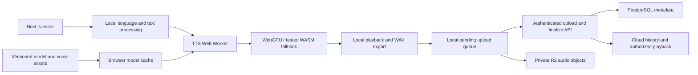

# ResonaAI code audit and development plan

Reviewed 2 October 2026. This is a planning document, not an implementation or a runtime benchmark.

## Agreed direction

- Release built-in voices first; add voice cloning later.
- Support English and Hindi/Hinglish on laptops.
- Run inference on the user's device, preferably through WebGPU.
- Retain cloud accounts and cloud generation history.

Recommendation: keep the Next.js application, Clerk, and PostgreSQL foundation. Build a browser TTS engine, prove Hindi/Hinglish quality early, and add cloud persistence around locally generated audio. Do not start by fine-tuning or copying the reference project's GPU backend.

## Evidence and review limits

The application repository is `resonaai/` inside the workspace. Its latest commit is `7ce7ede` (2 June 2026); the last committed TTS feature work is from 4 April. The current working tree also contains staged UI/form changes, dependency updates, and untracked tRPC/API scaffolding. Those changes were included in this review and preserved.

The reference repository was inspected from a temporary clone at commit `989036c6c4a136b43cfb0e37e50b5677421afffa`. Reviewed its generation/voice routers, form flow, storage integration, schema, and Modal deployment code. [Reference source](https://github.com/code-with-antonio/resonance/tree/989036c6c4a136b43cfb0e37e50b5677421afffa).

No installed `node_modules` or generated Prisma client was present. Build, type-check, lint, deployed authentication, database connectivity, and actual browser inference were not verified. Findings below distinguish source evidence from proposals; model performance remains unmeasured. No database migrations or application edits were made.

## Where development stopped

Your implementation roughly corresponds to the reference's TTS UI chapter, with backend infrastructure started. This is a feature-level comparison, not an exact tutorial checkpoint.

| Area | Current ResonaAI source | Remaining work |
|---|---|---|
| Application foundation | Next.js 16.1.6, React 19, Tailwind, reusable components | Reproducible installation, dependency compatibility, checks |
| Accounts/workspaces | Clerk pages, provider, organization selection, route protection | Verify running flows and enforce tenant ownership in data procedures |
| Dashboard | Sidebar, text entry, quick actions | Fix routing and carry text into the editor |
| TTS editor | TanStack form, text limit, sliders, submission state | Real engine, valid voice selection, useful error feedback |
| Generation | Submit handler waits two seconds | Entire inference and audio-output path |
| Voice library | Database shape and navigation link | Catalog, previews, filters, selection, model voice mapping |
| Audio player | Placeholder | Play/pause/seek/download, waveform, cleanup |
| History | Empty-state component and database schema | Write/read API, audio storage, detail page, deletion, pagination |
| tRPC | Handler and sample `hello` router | Real context, protected procedures, React Query provider, domain routers |
| Storage | Nullable R2 keys in schema | R2 client, uploads, reads, deletion and retry handling |
| Cloning/billing | No working implementation | Cloning later; revisit billing for local compute |
| Browser ML | No runtime, worker, model cache or device checks | New subsystem |

The README describes several intended features as already delivered. R2 integration, working generation, voice management, and resilient history are not implemented merely because the schema or documentation mentions them.

## Concrete issues to address first

1. `src/features/text-to-speech/components/text-to-speech-form.tsx:47` only simulates generation. Its default `voiceId` is the placeholder `default`, and whitespace-only input passes the string-length validation.
2. `src/features/dashboard/components/text-input-panel.tsx:22` navigates to `/text-to-speech/generate`, which has no route. Quick actions use the existing `/text-to-speech?text=...` route, but its page/view never reads that parameter. Prefer client draft state for user-written text to avoid placing full scripts in URLs.
3. `src/trpc/init.ts:8` returns the hardcoded `user_123`; the router has only a sample greeting. Route-level Clerk checks do not replace authenticated, tenant-scoped data access.
4. `src/app/test/page.tsx:5` calls `voice.findMany()` without organization filtering. The proxy protects access, but any admitted organization user could see other organizations' voice names/variants if records exist. Remove this test route or scope the query before deployment.
5. `package.json` mixes Prisma client/CLI 6.x with the PostgreSQL adapter 7.x. The lockfile resolves client 6.19.2, CLI 6.19.3 and adapter 7.5.0. Align compatible versions and regenerate; this is an identified compatibility risk, not a measured build failure.
6. `/voices` has no page. Voice cloning and help sidebar items have no action. Narrow-window settings/history drawers are absent, while the desktop panels are hidden below the large breakpoint.
7. The schema requires Chatterbox-specific generation parameters and cloud organization ownership. Keep ownership for cloud records, but replace required model-specific knobs with validated engine-specific settings. Preserve `voiceName` snapshots and deletion-safe history.
8. Enum names `CUSTIOMER_SERVICE` and `MOTIFATIONAL` are misspelled. Correct with a migration that preserves any existing data.
9. No project test suite or CI workflow was found. The `/test` page is a database smoke page, not an automated test suite.

## Model decision

**First candidate: Kokoro-82M, subject to a Hindi/Hinglish browser proof of concept.** Its weights are Apache-2.0. The model is a plausible compact starting point, not a guarantee of acceptable pronunciation or real-time performance. [Model card](https://huggingface.co/hexgrad/Kokoro-82M).

Important distinctions:

- The base model lists four Hindi voices. Its voice notes also caution about non-English quality. [Voice documentation](https://huggingface.co/hexgrad/Kokoro-82M/blob/main/VOICES.md).
- The inspected JavaScript wrapper validates English voice prefixes and maps pronunciation to `en-us`/`en`. Hindi requires a browser-compatible Hindi phonemizer, voice assets, correct phoneme mapping, and verification against the reference pipeline. Adding a language dropdown alone is insufficient. [Wrapper source](https://raw.githubusercontent.com/hexgrad/kokoro/main/kokoro.js/src/kokoro.js), [phonemizer source](https://raw.githubusercontent.com/hexgrad/kokoro/main/kokoro.js/src/phonemize.js).
- Start the WebGPU baseline with the documented FP32 configuration. The ONNX FP32 file is about 326 MB; the quantized file is about 92.4 MB. These are model-file sizes, not total download or peak memory. Do not assume the smallest quantization works correctly or fastest on WebGPU. Benchmark the exact runtime/model/dtype combination. [SDK instructions](https://github.com/hexgrad/kokoro/tree/main/kokoro.js), [ONNX files](https://huggingface.co/onnx-community/Kokoro-82M-v1.0-ONNX/tree/main/onnx).

Other candidates:

| Candidate | Role in the plan | Limitation |
|---|---|---|
| KittenTTS | Optional small English/CPU comparison | Multilingual remains on its roadmap; cannot satisfy the full launch scope by itself. Its web SDK is a developer preview. |
| Pocket TTS Hindi ONNX community export | Experimental Hindi comparison if Kokoro fails | Publisher reports a 106 MB CPU/browser pack; WebGPU, quality, maintenance and upstream redistribution terms need verification. Not a selected production dependency. |
| Chatterbox browser implementation | Later voice-cloning investigation | Resemble's demo downloads roughly 1.5 GB; its browser port has feature differences from the reference's Turbo server. Recheck Hindi support separately. |
| MMS Hindi | Possible research comparison | Model card declares CC-BY-NC-4.0; do not select as the default for a potentially commercial product. |

Sources: [KittenTTS](https://github.com/KittenML/KittenTTS), [KittenTTS Web](https://github.com/KittenML/KittenTTS-web), [Pocket Hindi export](https://huggingface.co/prasadvittaldev/pocket-tts-hindi-onnx-int4), [Resemble browser demo](https://github.com/resemble-ai/transformersjs-chatterbox-demo), [MMS Hindi model card](https://huggingface.co/facebook/mms-tts-hin).

### Hindi/Hinglish evaluation

Evaluate three separate modes: English, Hindi in Devanagari, and mixed-language Hinglish including Romanized Hindi. Script detection cannot distinguish Romanized Hindi from English reliably.

Create a fixed, human-reviewed evaluation set containing names, Indian places, dates, rupee amounts, abbreviations, punctuation and mixed clauses. Examples: `कल मेरी meeting 3 बजे है` and `Kal meri meeting teen baje hai`. Let users choose the input language and correct pronunciation/transliteration. Preserve original text separately from normalized text. Keep normalization, transliteration and phonemization local too.

Try using one compatible voice across language spans before switching models: stitching separate English and Hindi voices can produce distracting speaker changes. Measure pronunciation, omitted/repeated words, voice consistency and pauses through bilingual listening. Automated transcription is a secondary signal, not the sole acceptance test.

### Fine-tuning decision

Fine-tuning is not necessary to move inference into a browser and does not inherently shrink a model. First fix preprocessing, test available voices, and compare quantizations. Only train if a held-out evaluation identifies persistent quality gaps that these measures cannot solve.

If required, use a separate training workflow with appropriately licensed speech/text data, compare against the baseline, then export and verify ONNX/browser parity again. Training on a development machine or dedicated GPU is a separate decision from where user inference runs. User-device training is outside release one.

## Proposed architecture

Use Transformers.js/Kokoro integration first; reach for direct ONNX Runtime Web where the language adapter needs it. Keep ML modules client-only and lazily loaded. A worker should own model sessions and expose load, generate, cancel and dispose operations with typed messages. Check actual adapter/session creation, not just whether `navigator.gpu` exists. GPU failures need a clear retry or tested local CPU fallback. [ONNX Runtime WebGPU guide](https://onnxruntime.ai/docs/tutorials/web/ep-webgpu.html).

Cloud history means text/audio leave the device for storage. Product wording should say “generated on your device, saved to your account.” Hosting, storage, authentication and model distribution still have costs; only cloud inference is removed.

### New responsibilities

- **Model manager:** pinned revisions, asset manifest, download consent/progress, retry, cache verification, cache clearing and initialization progress. Report actual backend and precision. Handle missing/evicted cache; browser storage is not permanent. [Browser storage behavior](https://developer.mozilla.org/en-US/docs/Web/API/Storage_API/Storage_quotas_and_eviction_criteria).
- **Audio engine:** token-aware chunking before the model limit, sequential generation, early playback where supported, cancellation, WAV encoding, playback queue and object-URL cleanup. Do not pass the whole existing 5,000-character input into a potentially truncating model call.
- **Cloud save:** authenticated upload intent, server-generated organization-scoped key, short-lived upload authorization, finalize verification, idempotency key, upload size/type/duration limits and orphan cleanup. R2 credentials stay server-side. Failed saving must not discard successfully generated audio or require regeneration.
- **Ownership:** capture the active account/organization when a job begins. An organization switch must not silently save an old job into the new organization. Scope history queries and audio reads to the authenticated owner. Clear or partition pending local data on sign-out.
- **Generation records:** model ID/revision, engine version, precision, voice key/name snapshot, language mode, validated settings, audio duration/sample rate, storage key and save status. Distinguish generating, generated locally, uploading, saved and failed states.
- **UI controls:** replace cost estimates with model readiness and local-compute status. For a Kokoro baseline, expose supported voice/language/speed controls; remove misleading temperature/top-P/top-K sliders. Future engines can declare their own capabilities.
- **Observability:** report timings/failures without embedding scripts or voice samples in logs. Do not copy the reference's RPC-input capture blindly.

Suggested boundaries: `src/features/tts-engine/` for worker/runtime, `src/features/models/` for installation/cache UI, `src/features/voices/` for the catalog, `src/lib/storage/` for pending saves, and tRPC routers for catalog/history/upload coordination. Keep the current editor and dashboard feature layout.

## Ordered delivery plan

| Milestone | Work | Completion evidence |
|---|---|---|
| 0. Restore a reliable baseline | Preserve existing work; choose supported Node LTS; align Prisma; install from lockfile; fix broken routes, text handoff and `/test`; correct README status | Clean install, lint, type-check and production build; sign-in/org/editor smoke checks |
| 1. Prove the model and languages | Small browser harness for English, Hindi and Hinglish; local pronunciation; benchmark WebGPU and an eligible WASM fallback | Recorded model/runtime versions, device/browser specs, download/initialization time, first-audio latency, real-time factor, memory observations and bilingual listening results |
| 2. Deliver local TTS | Worker adapter, model installation, built-in catalog, supported settings, chunking, cancel, player and export | User downloads once and generates/listens/downloads in every launch language without a cloud inference request; all input is spoken without silent truncation |
| 3. Deliver cloud history | Authenticated upload/finalize, PostgreSQL records, R2 audio, history/detail/replay/delete, local retry queue | Generate on laptop A and replay on laptop B; failed upload retries without duplicates; another organization cannot access the record/audio |
| 4. Harden and release | Device errors, narrow-window UI, cache eviction, quotas, input limits, telemetry hygiene, accessibility, CI and deployment | Supported laptop matrix passes; cancel/GPU loss/network failure recover; smoke tests on deployed HTTPS origin; published support/download expectations |
| 5. Expand | Browser voice cloning; stronger Hindi/accent options; fine-tuning only if evaluation justifies it | Separate quality, memory, consent and language acceptance gates for each new capability |

Dependency order: milestone 0 → language/model proof → integrated generation → cloud history → launch. Milestone 1 is a genuine decision gate: if Hindi/Hinglish quality fails, compare another local model before completing engine-specific UI. An English-only internal prototype is useful evidence, but does not satisfy the agreed release scope.

Suggested initial benchmark targets, to ratify against actual minimum hardware: warm first playable chunk within about 3 seconds and real-time factor at or below 1 on the primary supported laptop. These are proposed product goals, not measured promises. Test at least a Windows integrated-GPU laptop and an Apple Silicon laptop in current Chrome/Edge; expand browser support after verification. Log system/browser memory where available rather than claiming portable VRAM measurements.

Meaningful automated coverage should target language/chunk boundaries, no text loss, generation cancellation and stale events, upload idempotency, organization isolation and history recovery. Add a small real-model browser smoke suite; mocked inference alone cannot establish WebGPU compatibility or audio quality.

## Product suggestions

Keep cloud accounts, but consider personal accounts before making every solo user create an organization. Preserve organizations if team workspaces are a launch goal; this is a product decision, not a required rewrite.

Defer the reference's per-character inference billing. If monetization is needed, cloud storage, collaboration and workflow features better match recurring server costs. Client-reported generation counts cannot provide trustworthy cloud-style inference metering.

Do not require a PWA/offline-auth rewrite for release one. Cache models for repeat use; distinguish generation with cached assets from fully offline application startup and cloud history. Fine-tuning, a desktop wrapper and mobile optimization should remain separate follow-up decisions.

Next implementation step: restore the baseline and build the English/Hindi/Hinglish benchmark harness. Select the production engine only after hearing and measuring that result.
## Implementation follow-through

The first local-inference slice is implemented. See [implementation status](implementation-status-2026-10-02.md) for verified results and remaining gates, and [local setup](local-speech-setup.md) for configuration. The status document supersedes this audit's description of the initial stub implementation.
